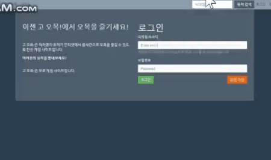
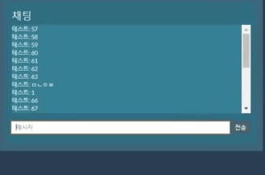
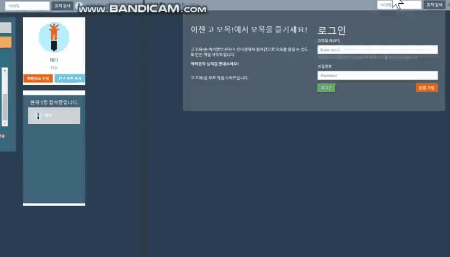
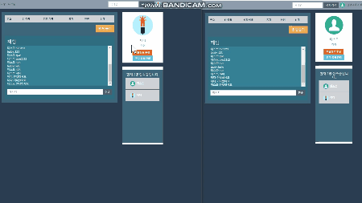

# omok_web

## 소개
 
omok_web(고! 오목)은 1:1 대전이 가능한 온라인 오목 게임 웹사이트입니다. 
시연 링크: https://youtu.be/aaiX_HEfwuY

## 주요 기능
- 회원가입, 로그인
- 대기실 공개 채팅, 스크롤 페이지네이션
- 현재 접속한 유저 표시
- 게임방 생성, 오목 플레이

## 사용 기술
- 언어: php, JavaScript, html
- 운영체제: Ubuntu 18.04
- 웹 서버: Apache 2.4
- 데이터베이스: MySQL 5.7
- 프로토콜: HTTP, TCP/IP
- 라이브러리, 기타: bootstrap, node.js(+socket.io), ajax

## 기능 설명
### 1. 회원가입, 로그인
사용자는 회원가입과 로그인 절차를 거쳐야 오목을 플레이할 수 있습니다. 

#### 회원가입
  
이메일 주소 입력 후 focus off시 ajax를 이용하여 이메일 중복 검사를 합니다. 
이메일 인증 버튼을 누르면 인증번호(6자리의 숫자)가 이메일로 발송됩니다. 
비밀번호는 정규 표현식(8자리 이상의 대, 소문자, 숫자와 특수 문자 포함)을 적용했습니다. 
프로필 사진 업로드를 할 수 있습니다. 
#### 로그인
 
로그인 페이지에서 입력한 id, pw와 서버 데이터베이스에 저장된 id, pw를 대조합니다. 
로그인을 성공하면 게임 대기실로 이동합니다. 
로그인 정보는 세션에 저장되어 있습니다. 

### 2. 대기실
사용자는 대기실에서 현재 접속중인 유저와 채팅을 할 수 있고, 현재 접속중인 유저의 목록을 볼 수 있습니다.

#### 공개 채팅
 
node.js와 socket.io를 이용하여 실시간 채팅을 구현했습니다. 
처음 대기실에 들어오면 최근 채팅 기록 20개를 볼 수 있습니다. 

#### 스크롤 페이지네이션
 
채팅창의 스크롤을 위로 올려 맨 위에 닿으면 이전 채팅 기록 20개를 더 가져옵니다. 

#### 현재 접속한 유저 표시
 
서버에 저장된 세션 정보를 이용하여 현재 접속하고 있는 유저들을 보여줍니다. 
유저를 누르면 해당 유저의 전적 페이지로 이동할 수 있습니다. 
현재 접속한 유저 정보는 5초마다 갱신됩니다. 

### 3. 게임방 생성, 오목 플레이
사용자는 대기실에서 게임방을 만들 수 있으며 다른 사람이 만들어 놓은 게임방에 참여할 수 있습니다. 
게임방에 참여한 두 사람 모두 준비가 완료되면 게임이 자동으로 시작됩니다.

#### 방 만들기, 입장
 
가운데 방 만들기 버튼을 누르면 모달창이 나오며 방이름과 비밀번호를 설정할 수 있습니다. 
비밀번호를 입력하지 않으면 공개방, 비밀번호를 입력하면 비공개방이 생성되고 게임방으로 이동합니다. 
대기실에서는 방 목록이 실시간 갱신됩니다. 
 
대기실에서는 생성된 방 목록과 방 정보를 볼 수 있습니다. 
대기 중인 방을 선택하면 해당 방에 들어갈 수 있습니다. 
비공개 방을 선택하면 비밀번호 입력 화면이 나오며 비밀번호를 맞게 입력하면 방에 들어갈 수 있습니다. 
유저가 들어오면 오른쪽에 상대방 정보가 표시됩니다. 
중앙에 있는 채팅창을 이용하여 서로 대화를 할 수 있습니다. 
#### 레디, 게임시작
 
레디 버튼을 눌러 준비 완료 상태에 들어가며 상대방에게도 준비 상태가 표시됩니다. 
두 명 모두 준비상태에 들어가면 오목 게임이 시작됩니다. 
#### 오목 플레이
오목을 플레이하는 동안에는 상대방을 추방할 수 없습니다. 
한 명이 돌은 두는 동안 상대방은 돌을 둘 수 없습니다. 
둘 중 한명이 먼저 오목을 달성하면 알림이 뜨며 게임이 종료됩니다. 
게임이 종료되면 레디 버튼과 추방 버튼이 다시 나타납니다. 
게임을 다시 시작하면 바둑돌이 사라집니다. 
#### 방 나가기, 방장 자동 위임, (방장)추방 기능
 
대기실 버튼을 눌러 게임방에서 대기실로 나올 수 있습니다. 
두 명일 때 한명이 나가는 경우 방이 유지됩니다. 
방장이 나가면 자동으로 남은 사람이 방장이 됩니다. 
방장에게는 추방 버튼이 있어 원하지 않는 상대방을 내보낼 수 있습니다. 
한명일 때 게임방을 나가게 되면 자동으로 게임방이 사라집니다. 
